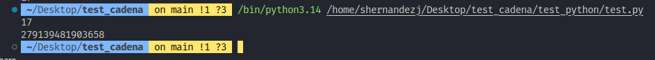
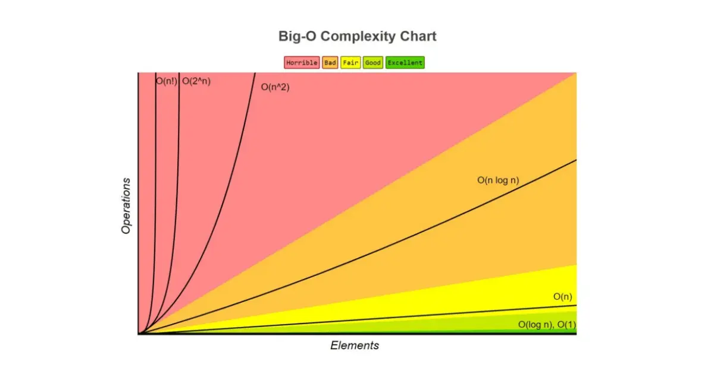
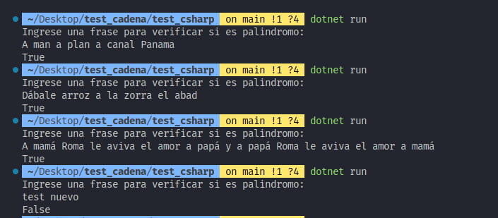
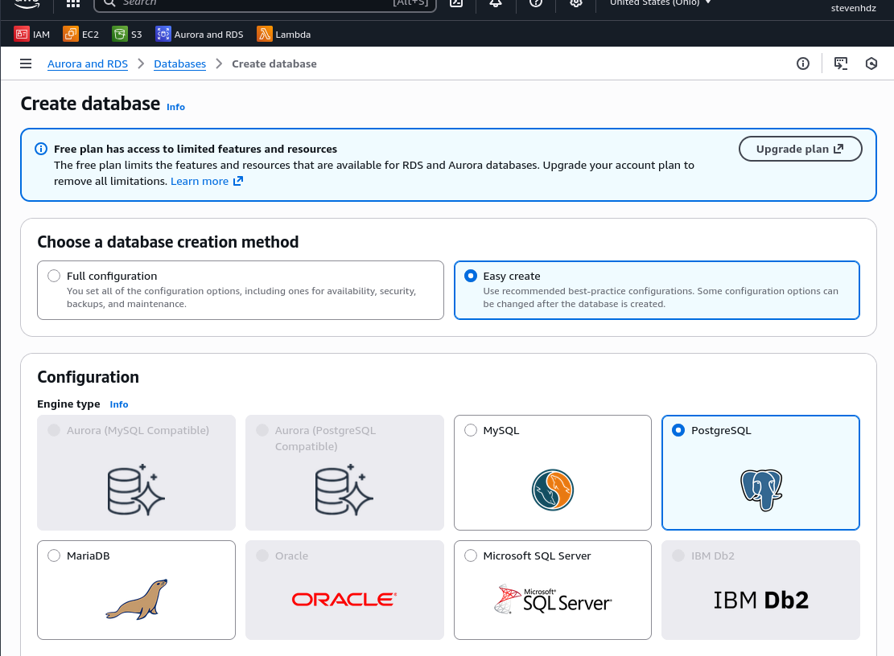
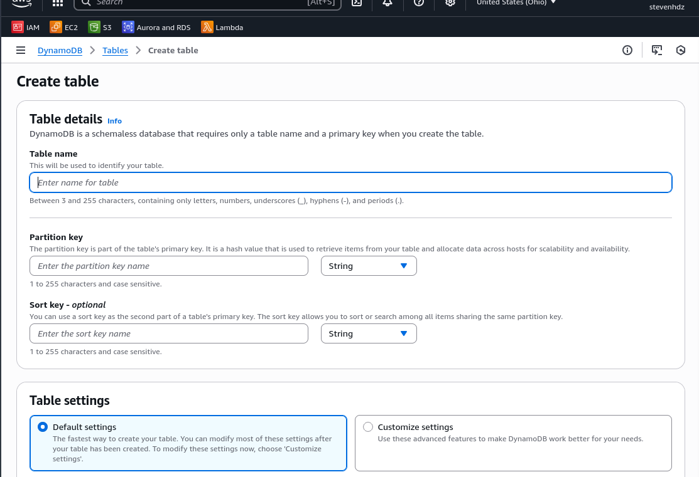
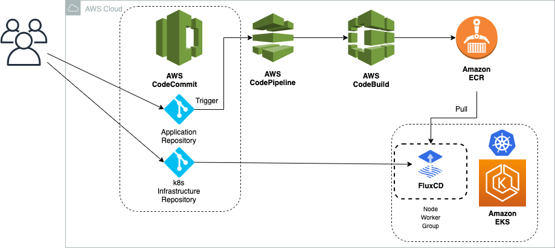

# Prueba tecnica avanzada (senior)
**Autor:** Steven Alexander Hernandez Jiminez  
**Rol:** Senior Full-Stack Software Engineer

# CODIGO 50%

# Python análisis de Primos

## Características implementadas
- Aplicación de principios **SOLID**.
- Algoritmos con notación **Big-O** analizada:
  - `criba()` → **O(n log log n)** tiempo, **O(n)** espacio.
  - `is_prime()` → **O(√n)** tiempo, **O(1)** espacio.
- Validaciones de entrada y manejo robusto de errores.
- Optimización usando **bytearray** para reducir memoria.

 

[ejemplo de codigo criba en test_python](test_python/) 

[ejemplo de codigo is_prime en test_python](test_python/) 

Benchmark Real (cProfile)

| Método                    | max_val     | Memoria extra aprox. | Tiempo aprox. | Ventaja principal                | Desventaja principal                   | Cuándo usarlo                            |
| ------------------------- | ----------- | -------------------- | ------------- | -------------------------------- | -------------------------------------- | ---------------------------------------- |
| **criba()**               | 100 000 000 | ~100 MB              | ~310 ms       | Ultra rápido para muchos números | Consume bastante RAM (tabla de primos) | Listas grandes, muchos números a evaluar |
| **is_prime()** por número | 100 000 000 | ~0 MB (O(1))         | 35–43 s       | Casi no usa memoria              | Muy lento si hay muchos números        | Pocos números pero muy grandes           |

bytearray (optimizacion de la criba 1 byte a menor peso en MB)

Explicación técnica:

La función básica `is_prime()` funciona correctamente bajo baja demanda, pero su complejidad **O(√n)** hace que escale muy pobremente en análisis intensivos.

La **Criba de Eratóstenes**, con **O(n log log n)**, consume más memoria, pero es **~8x más rápida** y soporta análisis de alto volumen sin degradación severa.

Aca es importante saber que existe una manera basica de hace is_prime() sin embargo esta manera no soporta alta demanda debido a que en ocasiones colapsa o demora demasiado por lo tanto en la notacion big O podemos apreciar que es tiempo O(√n) y espacio O(1) y la criba() es tiempo O(n log log n) y espacio O(n) a pesar de en memoria consume mas que la funcion anterior en tiempo es mucho mas rapido 8x que la anterior, soportando asi mejores analisis en menos tiempo.

- Preguntas clave al cliente:
- Cual es el **maximo numero** que procesara el sistema?
- Cual es el **SLA de tiempo de respuesta**?
- Se ejecutara en ambientes con memoria limitada?
- El procesamiento sera concurrente o secuencial?

---

 # C# Palindromos

- Patrón **SOLID** aplicado.
- Complejidad:
  - **O(n)** tiempo.
  - **O(n)** espacio por normalización (remover espacios/puntuación).
- Validación de errores y manejo de entradas no válidas.
- Soporte para frases complejas y oraciones completas.

[ejemplo de codigo palindromo en test_csharp](test_csharp/) 

 

# AWS AND CODE 50% 

 # Differences Between Amazon RDS and Amazon DynamoDB

Ejemplo con mi cuenta: 

### Amazon RDS (SQL)
- Base de datos relacional con **ACID**, JOINs y esquema estructurado.
- Escala principalmente vertical + read replicas.
- Ideal para:
  - ordenes
  - Pagos
  - Inventarios
  - ERP/CRM
  - Sistemas con transacciones complejas

Usos típicos: órdenes, pagos, inventarios, ERP/CRM, cualquier app que requiera SQL.

### Amazon DynamoDB (NoSQL)
- Base de datos **serverless**, key-value/document.
- Escala horizontal automático.
- Ultra baja latencia.
- Soporta millones de solicitudes por segundo.
- Ideal para:
  - Gaming
  - IoT
  - Perfiles de usuario
  - Apps serverless
  - Sesiones
  - Cargas masivas distribuidas

Usos típicos: gaming, IoT, perfiles de usuario, sesiones, apps serverless, cargas masivas.

 # Que es lambda ?

AWS Lambda es un servicio de cómputo serverless

## Caracteristicas principales
- Escala automaticamente de **0(n)** invocaciones.
- Cobra solo por tiempo de ejecucion.
- Event-driven: HTTP, colas, S3, CRON, DynamoDB Streams.
- Integracion nativa con toda la plataforma AWS.

## Ejemplo de arquitectura (endpoint /todos)

- **API Gateway** expone POST /todos  
- **Lambda** procesa la solicitud  
- **DynamoDB** guarda la tarea  

[ejemplo de codigo en test_lambda](test_lambda/) 

 # DEVOPS

DevOps acelera el desarrollo sin perder calidad y hace que los despliegues sean repetibles, seguros y automatizados.

### Core:

- Integración continua (**CI**)
- Entrega/despliegue continuo (**CD**)
- Infraestructura como código (**IaC**)
- Monitoreo y observabilidad
- Automatización end-to-end
- Feedback rápido entre equipos

### Importancia:

- Menos errores humanos  
- Releases mas rapidos  
- Mayor estabilidad  
- Mejor escalabilidad  
- Reduccion de costos operativos 

### CI (Integración Continua)
- Todo el código se integra frecuentemente.
- Pruebas automáticas detectan errores rápido.
### CD (Entrega/Despliegue Continuo)
- Builds automáticos, empaquetado y despliegues sin intervención manual.
- Releases rápidas y seguras.
### Infraestructura como Código (IaC)
- Servidores y redes se crean con código (CloudFormation, Terraform).
### Monitoreo y Observabilidad
- Logs, métricas y trazas para detectar fallas rápido. (Detenccion y respuesta exp en mercado libre)
### Automatización
- Todo lo que pueda automatizarse se automatiza.

----
## Con base a lo anterior vemos la importancia de porque siempre usar y ser parte de devops

### AWS CodeCommit — Repositorio Git

- Git privado y administrado por AWS.
- Máxima integración con IAM y CodePipeline.
- Se usa como fuente de código

### AWS CodeBuild — Construcción y pruebas

- Servicio administrado que compila código, ejecuta tests y genera artefactos.
- No administras servidores.
- Ideal para CI.

### AWS CodeDeploy — Automatización de despliegues

- Despliega en EC2, ECS, Lambda o servidores on-premise.
- Soporta rolling updates, blue/green, rollback automático.
- Reemplaza despliegues manuales

### AWS CodePipeline — Orquestador de CI/CD

- Conecta todo: CodeCommit → CodeBuild → CodeDeploy.
- Automatiza el flujo completo ante un push.
- Permite pasos manuales o automatizados.

Ejemplo:

DevOps es una cultura de automatización y colaboración que permite entregar software rápidamente con alta calidad. AWS soporta DevOps con CodeCommit (código), CodeBuild (build/tests), CodeDeploy (despliegues automáticos) y CodePipeline (orquestación CI/CD), permitiendo pipelines totalmente automáticos y escalables.

 # ¿Qué es una CI/CD pipeline con CodePipeline + CodeBuild?

 CodeCommit / GitHub → subes código (evento: push).
 CodePipeline → detecta el cambio y arranca la pipeline.
 CodeBuild → compila, corre tests, genera artefacto (build)
 Etapa de Deploy → puede ser a S3 (web estática), EC2, ECS, etc.

 Ejemplo:

 Deploy de una web estática HTML a un bucket S3 usando
CodePipeline + CodeBuild.

    aws cloudformation deploy \
    --template-file pipeline.yml \
    --stack-name static-site-pipeline \
    --capabilities CAPABILITY_IAM

[ejemplo de codigo en test_ci_cd](test_ci_cd/) 

CodePipeline orquesta el flujo: Source, Build, Deploy.
CodeBuild se encarga de compilar, correr tests y generar el artefacto (build).

En este ejemplo, el artefacto se despliega a un bucket S3 que sirve una web estatica.
Todo se dispara automaticamente con un git push a CodeCommit/GitHub, logrando una CI/CD real sin despliegues manuales.

 # Amazon S3

es un servicio de almacenamiento de objetos en AWS

Permite guardar archivos de cualquier tipo dentro de buckets y acceder a ellos desde cualquier lugar.

### Core

- Escalable automáticamente (no administras discos)
- Altamente durable (99.999999999%)
- Altamente disponible
- vPago solo por uso (GB almacenados + solicitudes)
- Compatible con SDK, CLI y API REST

### Casos de uso comunes

- Hosting de sitios estáticos (HTML, CSS, JS).
- Subida de archivos de usuario (imágenes, PDFs, videos).
- Data Lake y análisis (Athena, Glue, EMR) un amigo me enseño esto ya que el es data engineer
- Logs y backups (auditorías, respaldos de BD).
- Contenido multimedia (videos, audios, documentos).
- Integración con Lambda y servicios serverless.

Ejemplo:

[ejemplo de codigo en test_s3](test_s3/) 

Amazon S3 es almacenamiento de objetos escalable y durable; se usa para sitios estaticos, uploads, logs, backups y data lakes. Con Python puedes subir y descargar archivos facilmente usando la libreria boto3.